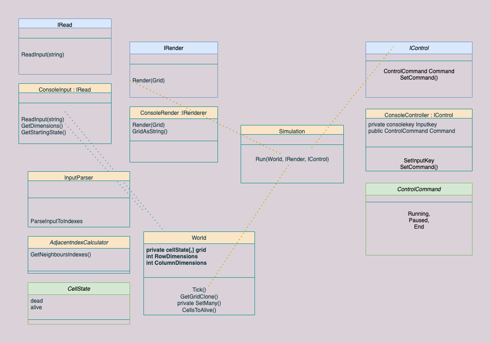

# Conways Game of Life

Conways Game of Life is a cellular automaton game that has excited and inspired many people who may not have usually bee interested in maths theory and is a unmatched contribution to the sphere of maths theory.

Read more about it and John Conway here:

https://www.conwaylife.com/wiki/Conway%27s_Game_of_Life

### Life is a system of complex behaviour based on very simple rules

•Any live cell with fewer than two live neighbours dies, as if caused by underpopulation.

•Any live cell with more than three live neighbours dies, as if by overcrowding.

•Any live cell with two or three live neighbours lives on to the next generation.

•Any dead cell with exactly three live neighbours becomes a live cell.


Programmed solutions take place on a virtual grid world and the rules are applied at a discrete moment known as the 'tick'. 

The initial state of the world is set and then the evolutions take place by repeatedly applying the rules.

In this solution the grid is 'wrapped' around on both axis. 

### Dependencies

dotnet skd 5.0.100

Find how to install dotnet here:

https://docs.microsoft.com/en-us/dotnet/core/install/how-to-detect-installed-versions?pivots=os-macos

check your dotnet version is 5.0.100 by running

```
dotnet --version
```

#### Set up

```
git clone git@github.com:GorginZ/Conways.git
```

change into the project directory

```
cd src
cd conways
```

build the project and it's dependencies:

```
dotnet build
```

#### To Run

cd into src

```
cd src
```

CD into main project

```
cd conways
```

And

```
dotnet run
```


User will be prompted for dimensions of the 'grid'/'world'

and the initial starting state of live cells for the world


The simulation begins


### Planning

The primary focus for this project was to create a very simple fast TDD solution to GOL. 

As I introduced new functionality it was preceeded by unit tests. As more of the project came together I utilized integration tests and acceptance tests.


The plan below is my original plan which contains elements no longer in my solution.

I have removed components that I built to keep the solution as simple as possible - the RowColumn indexer struct was useful but I could achieve the same behaviour using value tuples.

I initialy built a generic grid which would be a property on a world class - but this abstraction undermind my simple approach and I decided to keep the grid on the world as a 2d array.

### Initial Class Diagram


### Class Diagram



#### Simplifying

My goal was to design and create a quick an simple solution to Conways Game of Life with A TDD emphasis. 

GOL is a good candidit for following Four Rules of Simple Design

- **Passes the tests**: Is functionally correct, verified through comprehensive automated tests.

- **Reveals intention**: From the readers perspective the implementation is clear and unambiguous.

- **No duplication**: Is a [DRY](https://en.wikipedia.org/wiki/Don't_repeat_yourself) implementation, with no duplicated logic.

- **Fewest elements**: If the above 3 rules are met, any other elements of the design are superfluous and candidates for simplification.(1)

  

###### The Row Column Struct was a great candidate for the fourth rule.

I wanted a type I could compare by value that would work well in sets and reflect the domain I'm working with but working with structs comes with some overheads.


In the end I found what I needed using a value tuple and removed this all together.

```C#
namespace Conways
{
  public readonly struct RowColumn
  {
    public readonly int Row;
    public readonly int Column;

    public RowColumn(int row, int column)
    {
      Row = row;
      Column = column;
    }
    public bool Equals(RowColumn other) => (Row, Column).Equals(other);

    public override bool Equals(object obj)
    {
      if (!(obj is RowColumn rowCol))
        return false;
      return this.Row == rowCol.Row && this.Column == rowCol.Column;
    }
    public static bool operator ==(RowColumn a, RowColumn b) => a.Equals(b);
    public static bool operator !=(RowColumn a, RowColumn b) => !a.Equals(b);

    public override int GetHashCode() => (Row, Column).GetHashCode();
  }
}
```


#### TDD

I completed this kata (and all my recent ones as a matter of fact) with a TDD approach.

Learning to write reliable, simple unit tests has been one of the biggest educational milestones for me during acceleration. Being able to complete katas and only adding in anything that' runs' after finishing the business logic is very rewarding and gives me confidence that I understand how my data structures work  and that my tests are in fact reliable.

unit testing is a great sprinboard to think about things like decoupling, dependencies/dependency injection and other principles we should apply in production code.

for instance when I'm writing tests for how my console Renderer decides to render the data I need to think about the simplest way to give it that data and the simplest piece of data to test as a response. 


Writing the tests is often where I decided to make decisions about details.

For instance while writing tests for visualizing the grid in the console I decided I didn't want the world to be responsible for spitting out a grid as a string because the world as a domain is very succinct and explicit in what it does - it applies the tick rules, and providing the grid as a string is only ever going to be for rendering it. So I don't want this logic in my world class, it would be giving it too many responsabilities.

I made a IRender, which would take in a 'raw' grid and decide how to display that. The ConsoleRenderer takes in a Cellstate[,] and decides what to do with it. 

taking in a cellstate is preferable to for instance the entire world - all it needs is the grid. But I also did not want to expose the grid unecessarily, so the world provides a clone of its grid.

Writing tests that would show me visual data were a great place to make these decisions and an example of how a TDD aproach helped me to think about object design.


My tests check it renders it correctly from a raw dummy input (below).


And a seperate integration type test which utilizes a 'real' grid.


These test are visual tests and integration tests as they test how parts of the application come together as a whole. I test the application of the 'rules' by checking the values in indexes in the grid in series of unit tests as well as visually - which also has the added benefit of being easier to understand while also testing how seperate components come together while I also test with 'numbers' elsewhere.

#### Depenency Injection

The World Class takes in its starting state in its constructor. The world doesn't need to be responsible for collecting this data, it should just be able to apply the rules. There is no need for its state ot be set externaly at any point so my world class is designed with this in mind.

Simulation class is handed a IRenderer and a World.
It's single responsability is to run the simulation, similarly it should not need any external input  except maybe to cease the simulation.

#### Decoupling

I have done my best to keep my classes designed such that all of their dependencies are handed to them.

My world is/was dependent on the neighbourhood's static GetNeighbourhod function, which is a design decision I am unsure about and want more opinions on. I understand when we write programs we are writing systems and sometimes depenencies are part of that and not necessarily bad - in this instance from a decoupling perspective it may be desirable to put this function on the world class itself - but the dependency isn't a particularly risky one, the neighbourhood class isn't a complex object that may fail - it's an abstraction to help make my code more testable and readable and a side effect of my TDD approach, so it stays for now.

removing dependencies on console by keeping all logic seperate from input.

utilizing interfaces where appropriate to decouple the program from a explicitely console implementation, for instance all the set up arguments are returned from a ConsoleInput which implements IRead, which is passed into a world ready to go.


references:

1) https://martinfowler.com/bliki/BeckDesignRules.html